---
lab:
    title: 'Lab 04: Power Automate'
    module: 'Module 04: Power Automate'
---

> [!NOTE]
> Effective November 2020:
> - Common Data Service has been renamed to Microsoft Dataverse. [Learn more](https://aka.ms/PAuAppBlog)
> - Some terminology in Microsoft Dataverse has been updated. For example, *entity* is now *table* and *field* is now *column*. [Learn more](https://go.microsoft.com/fwlink/?linkid=2147247)
>

# Lab 04: Power Automate

In this lab, you will create Power Automate cloud flows to automate various parts of the Company 311 solution.

The following have been identified as requirements you must implement to complete the project: 

  - Escalation, approval, and execution process for urgent maintenance issues 

  - Notify reporting user about the issue status changes 

  - How to use a business rule to implement logic.

## What you will learn

  - How to design data columns (in the data model) to support automation 

  - How to build a flow using Microsoft Dataverse Connector

  - How to use approvals 

## High-level lab steps

  - Add columns to support escalation 
  - Build flow to approve escalation  
  - Build flow to notify user of status change
  - Build approval as an adaptive card in Microsoft Teams 

## Prerequisites

* Must have completed **Lab 02.1: Data model and model-driven app**
* Must have completed **Lab 02.2: Business Process Flows and Business Rules**

## Things to consider before you begin

  - What is the most efficient way to identify urgent maintenance issues and escalate them

## Detailed steps  

### Exercise 1: Build notify flow

In this exercise, you create a flow that will notify the creator of a problem when the status changes.

#### Task 1: Create flow

In this task, you will create a flow that send notification when the status of problem report row changes.

1.  Navigate to the [Power Apps maker portal](https://make.powerapps.com/) and make sure you are in the correct environment.

2.  Select **Solutions** and click to open the **Company 311** solution.

3.  Click **+ New >> Automation >> Cloud Flow >> Automated**.

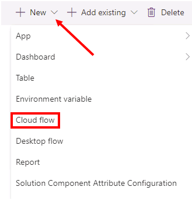

4.  Select **Microsoft Dataverse** connector. If **Microsoft Dataverse** connector is not visible, select **Connectors** tab then select **Microsoft Dataverse**.

5.  Select **When a row is added, modified or deleted**.

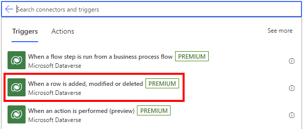

6.  Select **Modified** for **Change type**, select **Problem Reports** for **Table name**, **Organization** for **Scope** and click **Show advanced options**.

7.  Enter **statuscode** for **Select columns** and **… Menu** button of the trigger step.

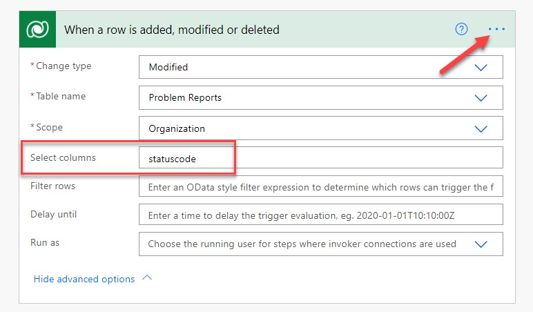

8.  Select **Rename**.

9.  Rename the trigger step **When problem report status changes**.

10.  Click **+ New step**.

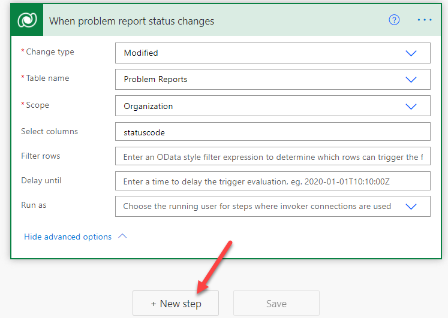

11. Select **Connectors** tab and then select **Microsoft Dataverse**. Select **Get a Row by ID**.

12. Select **Users** for **Table name**.

13. Click on the **Row ID** field, go to the Dynamic pane, search for **created** and click once on **Created By (Value)** to add it.

14. Click **Show advanced options** of the new step.

15. Enter **internalemailaddress** for **Select columns**.

16. Click on the **… Menu** button of the new step and select **Rename**.

17. Rename the step **Get problem creator**.

18. Click **+ New step**.

19. Search for **send email** and select **Send an email (V2).**

20. Click to select the **To** Column and click **Switch to advanced mode**. Click on this button toggles show/hide of the dynamic pane.

21. Select the **Primary Email** Column from the **Get problem creator** step.

22. Enter **Problem report status change notification** for **Subject**.

23. Click to select the **Body** Column.

24. Type **The status of the problem you reported has changed.** and press the **[ENTER]** key.

25. Type **Problem Title:** go to the Dynamic pane, search for **title** and select **Title**.

26. Press the **[ENTER]** key.

27. Type **Current Status:** go to the Dynamic pane, select the **Expression** tab, paste the expression below, and click **OK**. This expression will show the label of the choice instead of the value.

`triggerOutputs()?['body/_statuscode_label']`

28. Click on the **… Menu** button of the new step and select **Rename**.

29. Rename the **Notify problem creator**.

30. The step should now look like the image below.

31. Scroll up change the flow name from Untitled to **Notify Problem Creator.**

32. Click **Save** and wait for the flow to be saved.

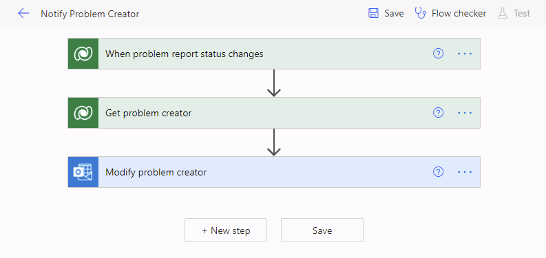

33. **Close** the flow designer browser window or tab.

34. Click **Done** on the popup window.

#### Task 2: Test the flow

In this task, you will test the notify problem creator flow.

1.  Make sure you are still on the [Power Apps maker portal](https://make.powerapps.com/) site and you are in the correct environment.

2.  Select **Apps**, and then select the **Company 311 Admin** Model-driven application. Click **Play**.

3.  Click **+ New**.

4.  Enter **Flow test** for **Title**, select **London Paddington** for **building**, enter **This is a flow test** for **Details**, and click **Save**.

5.  Scroll down and change the **Status Reason** value to **In Progress** and save again.

6.  Close the application browser window or tab.

7.  You should now be back to the [Power Apps maker portal](https://make.powerapps.com/)

8.  Select **Solutions** and click to open the **Company 311** solution.

9.  Locate and click to open the **Notify Problem Creator** flow you created.

10. You should see a succeeded flow run in the **28-day run history section**. Click to open the run.

11. All the flow steps should have a **green** check mark.

12. Click **App launcher** and select **Outlook**.

13. You should get an email from the flow. Click to open the email.

14. The email should look like the image below.

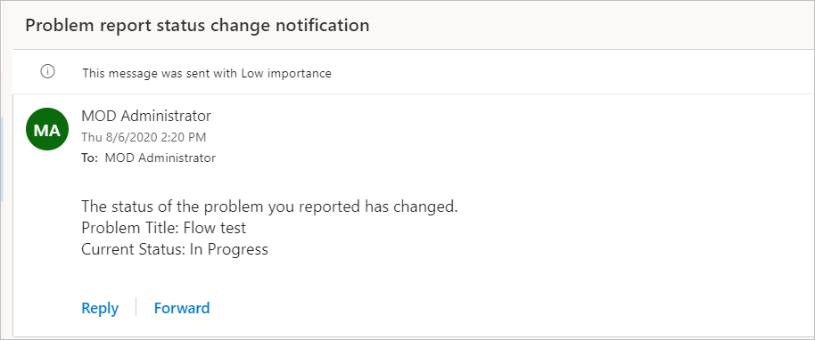

### Exercise 2: Build escalation flow

In this exercise, you create add two new Columns to the problem report Table and create escalation flow.

#### Task 1: Add Columns

In this task, you add a new Columns to the problem report Table.

1.  Navigate to the [Power Apps maker portal](https://make.powerapps.com/) and make sure you are in the correct environment.

2.  Select **Solutions** and click to open the **Company 311** solution.

3.  Locate and click to open the **Problem Report** Table.

4.  Make sure you have the **Columns** tab selected and click **+ Add Column**.

5.  Enter **Estimated Cost** for **Display name**, select **Currency** for **Data type** and click **Done**.

6.  Click the **Save Table** located on bottom right of the screen.

7.  Select the **Forms** tab.

8.  Click to open the **Information** form of type **Main**.

9.  Add **Estimated Cost** Column to the form and place it below the **Status Reason** Column.

10. Add the **Assign to** Column and place it below the **Estimated Cost** Column.

11. The **Resolution details** section of the form should now look like the image below. Click **Save**.

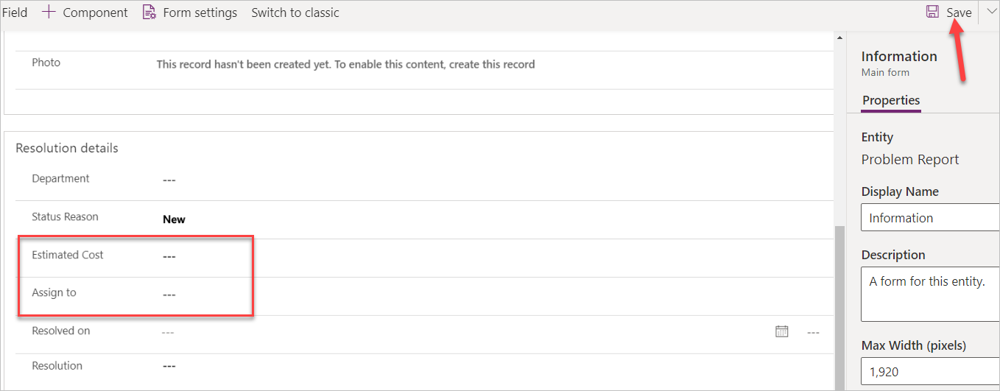

12. Click on the **Back** button located on the top left of the screen.

13. Select **Solution**, click **Publish all customizations**, and wait for the publishing to complete.

#### Task 2: Build escalation flow

In this task, you will create the escalation flow.

1.  Navigate to the [Power Apps maker portal](https://make.powerapps.com/) and make sure you are in the correct environment.

2.  Select **Solutions** and click to open the **Company 311** solution.

3.  Click **+ New >> Automation >> Cloud Flow >> Automated**.

4.  Search for **when a row is added** and select **When a row is added, modified, or deleted**  from **Microsoft Dataverse** connector.

5.  Select **Added or Modified** for **Change type**, select **Problem Reports** for **Table name**, select **Organization** for **Scope** and click **Show advanced options**.

6.  Enter **lh_estimatedcost,lh_assignto** for **Select columns** and click **Hide advanced options**.

7.  Click on the **… Menu** button of the trigger step and select **Rename**.

8.  Rename the trigger step **When a problem report is created or updated**.

9.  Click **+ New step**.

10. Search for **Condition** and Select **Condition** control.

11. Click to select the first **Choose a value** Column.

12. Go to the Dynamic content pane, search for **estimated** and select **Estimated Cost**.

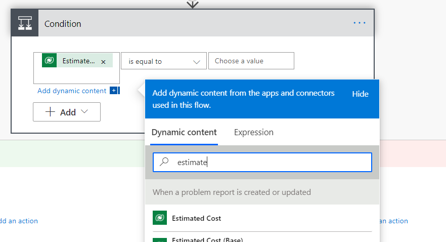

13. Select **is greater than** in the second field and enter **1000** in the third field.

14. Rename the condition step to **Check if cost is greater than 1000**.

15. Go to the **If yes** branch and click **Add an action**.

16. Search for **Get a row** and select **Get a row by ID** from **Microsoft Dataverse**.

17. Select **Users** for **Table name**.

18. Click to select the **Row ID** Column and select **Assign to (Value)** from the **Dynamic content** pane.

19. Click **Show advanced options**.

20. Enter **internalemailaddress** for **Select columns**.

21. Click **Hide advanced option**.

22. Rename the **Get a Row by ID** step **Get user**.

23. Click **Add and action**.

24. Search for **approval** and select **Start and wait for an approval**.

25. Select **Approve/Reject - Everyone must approve** for **Approval type**.

26. Enter **Cost approval required** for **Title**.

27. Click to select the **Assigned to** Column.

28. Go to the **Dynamic content** pane and select **Primary Email** from the **Get user** step.

29. Paste the markdown text below in the **Details** Column.

> \#\# URGENT Approval Required
>
> This is \*\*very\*\* expensive item with the estimated cost of

30. Place your cursor after cost of, go to the Dynamic content pave, select the Expression tab, paste the expression below, and click **OK**.

`formatNumber(triggerOutputs()?['body/lh_estimatedcost'], 'C2')`

31. Click **Add an action**.

32. Search for **condition** and select **Condition** control.

33. Click to select the first **Choose a value** Column.

34. Go to the **Dynamic content** pane, search for **Outcome** and select **Outcome**.

35. Select **equals to** in the second field and type **Reject** for value in the third field.

36. Go to the **If yes** branch and click **Add an action**.
37. Search for **update a Row** and select **Update a Row** from **Microsoft Dataverse**.

38. Select **Problem Reports** for **Table name**.

39. Click to select the **Row ID** Column.

40. Go to the **Dynamic content** pane, search for **problem report** and select **Problem Report**.

41. Click **Show advanced options**.

42. Click to select the **Resolution** Column, go to the **Dynamic content** pane and select **Response summary**.

43. Select **Won’t fix** for **Status Reason**.

44. Rename the step **Update problem report**.

45. Scroll up and rename the flow **Escalate Expense Approval**.

46. Click **Save**.

47. Close the flow designer browser window or tab.

48. Click **Done** on the popup.

#### Task 3: Test flow

In this task, you will test the escalation flow

1.  Navigate to the [Power Apps maker portal](https://make.powerapps.com/) and make sure you are in the correct environment.

2.  Select **Apps** and click to open the **Company 311 Admin** application.

3.  Click to open one of the **Problem Report** rows.

4.  Scroll down, enter **2500** for **Estimated Cost**, assign it to **yourself** (for test purposes) and click **Save**.

5.  Navigate to [Power Automate](https://us.flow.microsoft.com/en-us/)

6.  Expand **Action Items** and select **Approvals**.

7.  You should see at least one approval in the received tab. Click to open the approval. It can take around 10-15 minutes for approvals to show up here on the first run.

8.  Select **Reject**, enter **We don't have the funds for this item** for **comment**, and click **Confirm**.

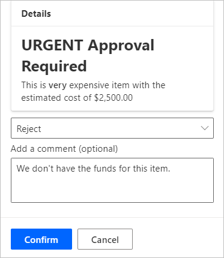

9.  Go back to the **Company 311 Admin** application.

10. Change the view to **My Reports** and click to open the same row you change the estimated cost.

11. The **Status Reason** should be set to **Won’t fix** and the **Resolution** should contain the details of Approver, Response, Request Date and Response Date.

12. Click **Save**, if you have not done so previously.

### Exercise 3: Send approval requests as adaptive card in Microsoft Teams

In this exercise, you will setup a team in Microsoft Teams dedicated to the Company 311 applications. You will modify the flow to send the approval request as an adaptive card in Teams chat instead of an approval message.

* Task 1: Setup Company 311 Team
* Task 2: Modify flow to send adaptive card in Teams chat
* Task 3: Test adaptive card

#### Task 1: Setup Company 311 Team

In this task you will setup a Microsoft Teams team for the Lamna Healthcare Company, if you have not done so in previous exercises.

**Note:** If you have already created the **Company 311** Teams in the Microsoft teams, skip this part and continue to the next task.

1.  Navigate to [Microsoft Teams](https://teams.microsoft.com) and sign in with the same credentials you have been using previously.

2.  Select **Use the web app instead** on the welcome screen.

3.  When the Microsoft Teams window opens, dismiss the welcome messages.

4.  On the bottom left corner, choose **Join or create a team**.

5.  Select **Create a team**.

6.  Press **From scratch**.

7.  Select **Public**.

8.  For the Team name choose **Company 311** and select **Create**.

9.  Select **Skip** adding members to Company 311.

#### Task 2: Modify flow to send adaptive card in Teams chat

In this task you will replace the approval sent by email with the adaptive card.

1. Locate **Start and wait for an approval** step created earlier in **Exercise 2, Task 2**. (Navigate to the [Power Apps maker portal](https://make.powerapps.com/) and make sure you are in the correct environment. **Solutions >> Company 311 Solution>> Flows >> Escalate Expense Approval**) 
2. Select **...** then select **Delete**.
3. Click **+** between the steps to insert a new step then select **Add an action**.
4. Search for **approval** and select **Create an approval**.
5. Select **Approve/Reject - Everyone must approve** for **Approval type**.
6. Enter **Cost approval required** for **Title**.
7. Click to select the **Assigned to** Column.
8. Go to the **Dynamic content** pane and select **Primary Email** from the **Get user** step.
9. Paste the markdown text below in the **Details** Column.

> \*\*{title}\*\*
>
> 
>
> {details}
>
> 
>
> This is a \_very\_ expensive item with the estimated cost of

10. Select **{title}** placeholder, go to the **Dynamic content** pane, locate and select **Title** Column from **When a problem report is created or updated** step.

11. Select **{details}** placeholder, go to the **Dynamic content** pane, locate and select **Details** Column from **When a problem report is created or updated** step.

12. Place your cursor after **cost of** , go to the **Dynamic content** pane, select the **Expression** tab, paste the expression below, and click OK.

`formatNumber(triggerOutputs()?['body/lh_estimatedcost'], 'C2')`

13. Your step should look like the following:

14. Click **+** then select **Add an action**.

15. Search for **teams** and select **Post adaptive card in a chat or channel** action.

16. Select **Flow bot** for Post as and select **Chat with Flow bot** for Post in.
17. Click to select the **Recipient** field.

18. Go to the **Dynamic content** pane and select **Primary Email** from the **Get user** step.

19. Click to select **Adaptive Card** field.

20. Go to the **Dynamic content** pane and select **Teams Adaptive Card** from the **Create an approval** step.
21. Post adaptive card in chat or channel should look like the image below.

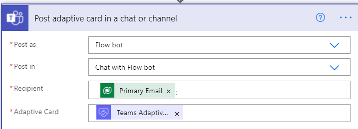

22. Select **+** then select **Add an action**.

23. Search for **approval** and select **Wait for an approval** action.

24. Select **Approval ID** Column.

25. Go to the **Dynamic content** pane and select **Approval ID** from the **Create an approval** step.

    

26. You now have replaced **Start and wait for an approval** step with the following:

25. Expand **Condition 2** step. The left side of the condition should be empty because it was referring the step which is now removed. 
26. Go to the **Dynamic content** pane, search for **outcome,** and select **Outcome** from **Wait for an approval** step. 
27. Locate **Update problem report** step under **If yes** branch.
28. Click **Show advanced options**.
29. Click to select the **Resolution** Column, go to the **Dynamic content** pane, and select **Response summary** from **Wait for an approval** step.
30. Click **Save**.
31. Close the flow designer browser window or tab.
32. Click **Done** on the popup.

#### Task 3: Test flow

In this task, you will test the escalation flow with the Teams and adaptive cards.

1.  Navigate to the [Power Apps maker portal](https://make.powerapps.com/) and make sure you are in the correct environment.

2.  Select **Apps** and click to open the **Company 311 Admin** application.

3.  Click to open one of the **Problem Report** Rows.

4.  Scroll down, enter any amount greater than **1000** for **Estimated Cost**, assign it to **yourself** (for test purposes) and click **Save**.

5.  Navigate to [Microsoft Teams](https://teams.microsoft.com)

6.  Select **Chat**.

7. You should see the Cost Approval Required Adaptive Card.

  

8. Press **Reject** button and enter a comment of your choice in the Comments area, for example **The item is too expensive**.

9. Select **Submit**.  The card will become read-only.

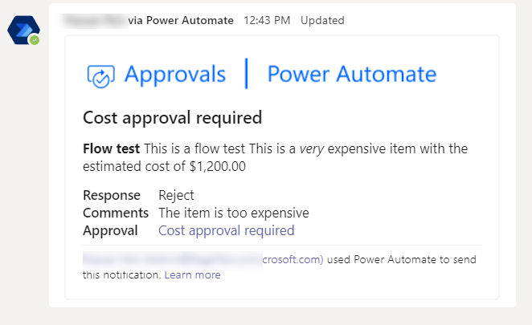

10. Go back to the **Company 311 Admin** application.

11. Change the view to **My Reports** and click to open the same Row you change the estimated cost.

12. The **Status Reason** should be set to **Won’t fix** and the **Resolution** should contain the details of Approver, Response, Request Date and Response Date.

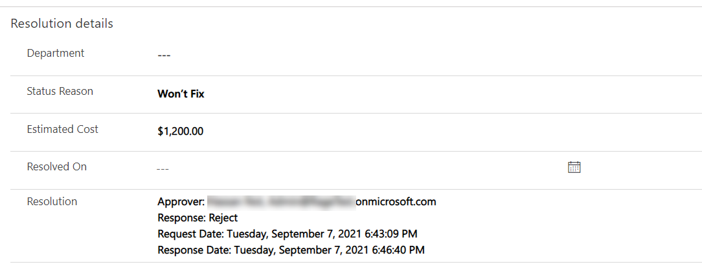

## **Discussion**

  - Would creating a bool Column for Approved/Rejected be better?
  - What are the pros and cons of using Microsoft Teams over regular email?

## **Bonus exercises**

  - Add ability for the users to subscribe to the reported problems and only notify if there is a subscription. 
  - Auto-subscribe creator of the problem report.
  - How to find out previous value of status reason?
  - Create your own adaptive card using [Adaptive Cards Designer](https://adaptivecards.io/designer/).
