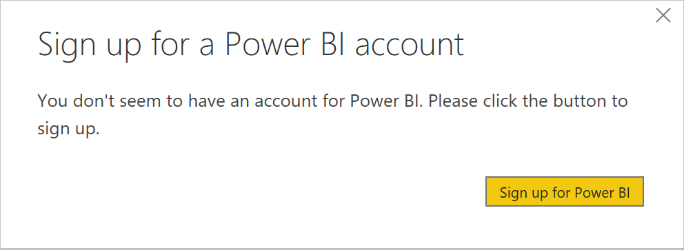
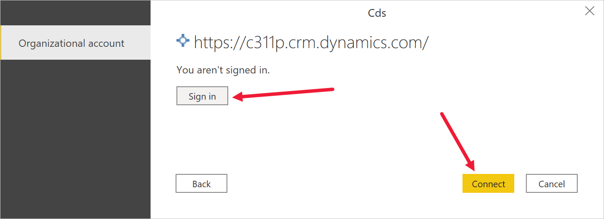
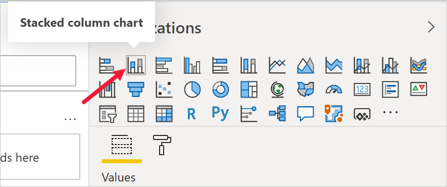
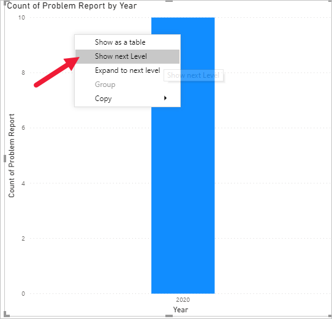
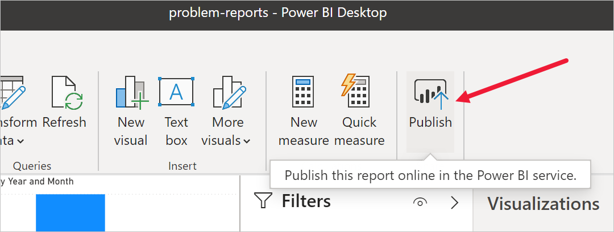
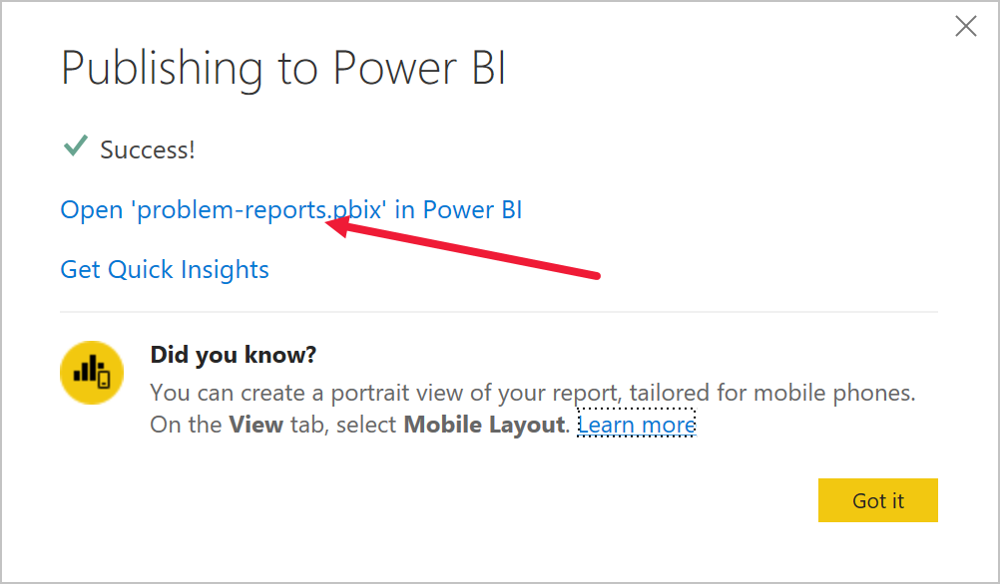
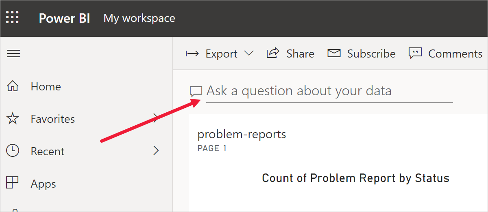
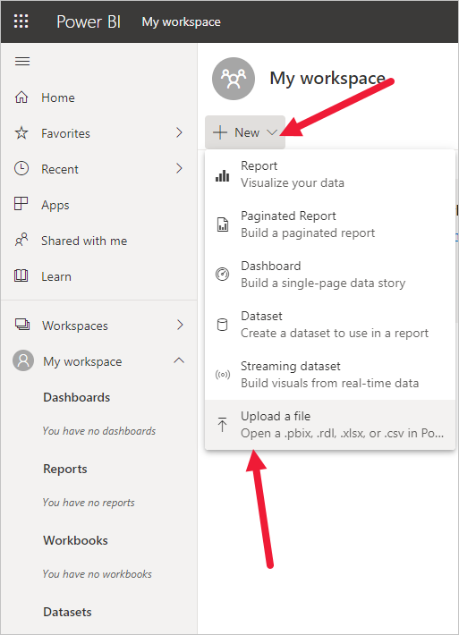

---
lab:
    title: 'Lab: Power BI'
    module: 'Module 6: Power BI'
---

> [!NOTE]
> Effective November 2020:
> - Common Data Service has been renamed to Microsoft Dataverse. [Learn more](https://aka.ms/PAuAppBlog)
> - Some terminology in Microsoft Dataverse has been updated. For example, *entity* is now *table* and *field* is now *column*. [Learn more](https://go.microsoft.com/fwlink/?linkid=2147247)
>
> This content will be updated soon to reflect the latest terminology.


# LAB 06: Power BI

In this lab, you will build a Power BI dashboard that visualizes data about problems reported by company employees.

## What you will learn

  - How to connect to the data 
  - How to refine the data model and prepare it for reporting
  - How to create a Power BI visualization 
  - How to embed a Power BI report in Microsoft Teams

## High-level lab steps

We will follow the below steps to design and create the Power BI dashboard:

-   Connect to Microsoft Dataverse 
-   Transform the data to include user-friendly descriptions for the related Rows (lookups)
-    Create and publish a report with various visualizations of the information about problem reports
-    User natural language query to build additional visualizations
-    Build mobile view
-    Embed the Company 311 Power BI report to Microsoft Teams

## Prerequisites

* Must have completed **Lab 02: Data model and model-driven app**
* Permissions to install programs on your computer (required for Power BI Desktop installation)

## Things to consider before you begin

-   Who is the target audience of the report?
-   How will the audience consume the report? Typical device? Location?
-   Do you have sufficient data to visualize?
-   What are the possible characteristics you can use to analyze data about the visits?

## Detailed steps

### Exercise 1: Prepare environment & data  

**Objective:** In this exercise, you will install and configure Power BI Desktop and configure a connection to Microsoft Dataverse. 

> [!IMPORTANT]
> If you do not have required permissions to install desktop applications or experience difficulties in configuring Power BI Desktop and connecting it to the data, follow **Exercise 5: Import sample data** and then continue on **Exercise 2** but using Power BI service instead of Power BI Desktop.

#### Task 1: Configure Power BI Desktop

1. If you do not have Power BI Desktop installed, navigate to [https://aka.ms/pbidesktopstore](https://aka.ms/pbidesktopstore) to download and install Power BI app.

> [!IMPORTANT]
> If you experience issues installing Power BI Desktop using Microsoft Store, try standalone installer that can be downloaded from [https://aka.ms/pbiSingleInstaller](https://aka.ms/pbiSingleInstaller).

2. Open Power BI Desktop
2. If you were signed in into Power BI Desktop previously, select **File | Sign out** 
3. Sign in if prompted or select **File | Sign in** to sign in.  
4. If you're signing in for the first time you may receive the following prompt



6. Select **Sign up for Power BI** and follow the prompts to complete the sign up 

#### Task 2: Prepare Data

1.  Find out your organization URL

    * Navigate to Power Platform Admin Center at https://aka.ms/ppac.
    * In the left navigation page, select Environments, and then click on the target environment.
    * Right mouse click **Environment URL** on the **Details** panel, then select **Copy link**.


2. Switch to Power BI desktop

3. Select **Get data | More...**


4. Select **Power Platform**, then select **Common Data Service**, and press **Connect**.


5. Type **https://** and paste the environment URL you copied earlier.  Click **OK**.


6. The connection details dialog will open up. If you are not signed in, press **Sign in** and follow the prompts to sign in. Press **Connect**. 



7. Expand **Entities** node, select **lh_Building**, **lh_Department**, **lh_ProblemReport** Tables, press **Load**. Wait until the load is complete.


8. Click **Model** icon on the left vertical toolbar.


9. Drag **lh_buildingid** column from **lh_Building** table and drop it to **lh_building** column in **lh_ProblemReport** table. That will create a relationship between two Tables that Power BI will be able to use to display related data.


10. Repeat the previous step to drag **lh_departmentid** column and drop it into **lh_department** column in **lh_ProblemReport**. Your diagram should look like this:


11. Select **Report** icon on the left toolbar.


12. Expand **lh_ProblemReports** node in the **Fields** panel.

13. Click ... and select **New Column**.


14. Complete the formula as following

```
Building = RELATED(lh_Building[lh_name])
```

and press ENTER or click checkmark button. That will add a new column with the building name into the problem report data.


15. Repeat two previous steps to add a column **Department** with the following formula 

``` 
Department = RELATED(lh_Department[lh_name])
```

16. Click ... next to the **lh_problemreportid** column and select **Rename**. Enter **Problem Report** as the column name.
17. Click ... next to the **statuscode_display** column and select **Rename**. Enter **Status** as the column name.
18. Save work in progress by pressing **File &#124; Save** and entering a filename of your choice.

### Exercise 2: Create Power BI Report 

**Objective:** In this exercise, you will create a Power BI report based on data from Microsoft Dataverse database.

#### Task 1: Create Chart and Time Visualizations

1. Press pie chart icon in the **Visualizations** panel to insert the chart.


2. Drag **Building** Column and drop it into **Legend** target box.
3. Drag **Problem Report** Column and drop it into **Values** target box.


4. Resize the pie chart using corner handles so that all chart components are visible. Your report should now look like this:


5. Click **New visual** on the Power BI ribbon then select stacked column chart in **Visualizations** pane. 



6. Drag **Problem Report** Column and drop it into **Values** target box.
7. Drag **createdon** Column and drop it into **Axis** target box.
8. Click **x** next to **Day** and **Quarter** to leave only **Year** and **Month** totals.

> [!TIP]
> Initial stacked column chart will only display the year level. To access monthly data breakdown you need to expand report into the monthly level. The easiest way to drill down is right-button click on the report and select **Expand next level**.



9. Resize the chart as required using the corner handles.
10. Test the report interactivity:

    * Select various building slices on the pie chart and observe changes on the time report.
    * Select various bars on the time column chart and observe changes on the pie report.
    * Drilldown to the month level using icons or **Data/Drill | Expand next level** ribbon command or drilldown toolbar


11. Save work in progress by pressing **File | Save**.

#### Challenge

* Replace grouping by building with grouping by **Status** column 

### Exercise 3: Create Power BI Dashboard

#### Task 1: Publish Power BI Report

1. Press **Publish** button on the ribbon.



2. Select **My workspace** as the destination, then press **Select**.

3. Wait until publishing is complete and click **Open \<name of your report\>.pbix in Power BI**.



This will open the published report in the browser.

#### Task 2: Create Power BI Dashboard

1. Expand **My workspace**.
2. Select the report under **Reports** heading.


3. Select **Pin a live page** on the menu. Depending on the layout you may need to press **...** to show additional menu items.


4. Select **New dashboard** on **Pin to dashboard** prompt.
5. Enter **Problem Management** as a **Dashboard name**, press **Pin live**.


6. Select **My workspace** node, select **Problem Management** dashboard.
7. Test interactivity of the pie and bar charts displayed.

#### Task 3: Add Visualizations Using Natural Language

1. Select **Ask a question about your data** on top of the dashboard



2. Enter **funnel count of problem reports by status** in Q&A area. The funnel chart will be displayed.
3. Select **Pin visual**.


4. Select **Existing dashboard**, select **Problem Management** dashboard, press **Pin**.
5. Test the behaviour by clicking on the chart to drilldown to Q&A.

#### Task 4: Build Mobile Phone View

1. Select the **Problem Management** dashboard from **Dashboards** area.
2. Depending on the UI version select either **... &#124; Mobile View** or  **Web View &#124; Phone View**.
3. Rearrange tiles as desired.


4. Select your report under **My Workspace | Reports**
5. Select **... | Generate QR Code**.


6. If you have a mobile device, scan the code using a QR scanner app available on both iOS and Android platforms.

> [!NOTE]
> To access the dashboard and report you will have to sign in on the phone as the same user.

7. Navigate and explore reports and dashboards on a mobile device. 

### Exercise 4: Embed Power BI report in Microsoft Teams

In this exercise, you will add the Company 311 Power BI report in Microsoft Teams as a way for management and staff to be able to view the reports from directly within Teams. 

#### Task 1: Setup Company 311 Team

In this task you will setup a Microsoft Teams team for the Lamna Healthcare Company, if you have not done so previously.

1.  Navigate to [Microsoft Teams](https://teams.microsoft.com) and sign in with the credentials you have been using previously.

2.  Select **Use the web app instead** on the welcome screen.


3.  When the Microsoft Teams window opens, dismiss the welcome messages.

4.  On the bottom left corner, choose **Join or create a team**.

5.  Select **Create a team**.


6.  Press **Build a team from scratch**.

7.  Select **Public**.

8.  For the Team name choose **Company 311** and select **Create**.

9.  Select **Skip** adding members to Company 311.


#### Task 2: Embed Power BI report to Teams

1.  Navigate to [Microsoft Teams](https://teams.microsoft.com)

2.  Select the **General** channel of the **Company 311** team.

3.  On the top of the page, press the **+** symbol to add a new tab.


4.  Search for **power** and select **Power BI** from the results.

5.  Expand **My workspace** and select the report you created earlier in this lab.


6.  Click **Save**  You should now see your Power BI report in a tab in Microsoft Teams


## Challenges

* Dashboards and reports to include drilldown to individual reports with photos
* Report and analyze problem patterns and trends
* Problem resolution status visualization as a funnel

## Addendum

### Exercise 5: Import sample data

In this exercise you will import sample data into Power BI service. That allows you to complete the lab exercises even if do not have required permissions to install desktop applications, or experience difficulties in configuring Power BI Desktop and connecting it to the data. After completion of this exercise you can resume the lab on **Exercise 2** and use Power BI service ([https://app.powerbi.com](https://app.powerbi.com)) instead of Power BI Desktop. 

1. Download [problem-reports-data.pbix](06\Resources\problem-reports-data.pbix) and save on your computer.
2. Navigate to [https://app.powerbi.com/](https://app.powerbi.com/).
3. Click **My Workspace**.
4. Expand **+New** and select **Upload a file**.



5. Select **Local File**.
6. Locate and select **problem-report-data.pbix** file you've downloaded earlier.
7. Once data load is complete, select **problem-reports-data** report.
8. Click **...** then select **Edit**.


9. Continue on **Exercise 2**.
